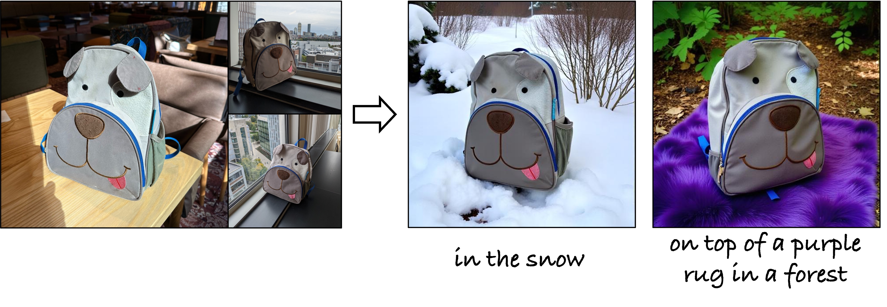
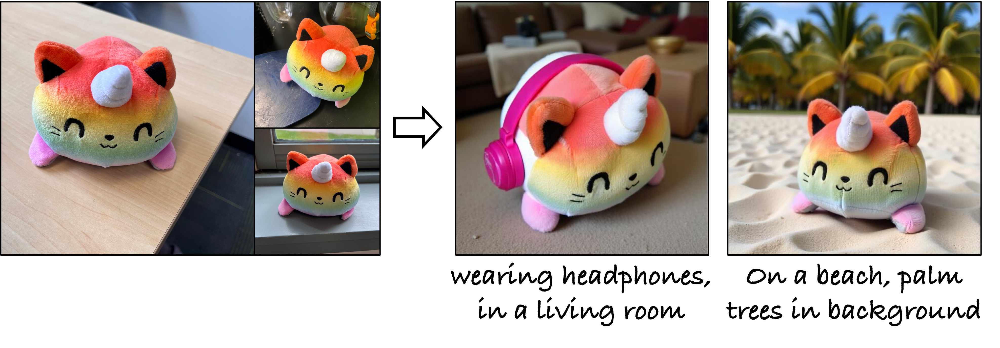
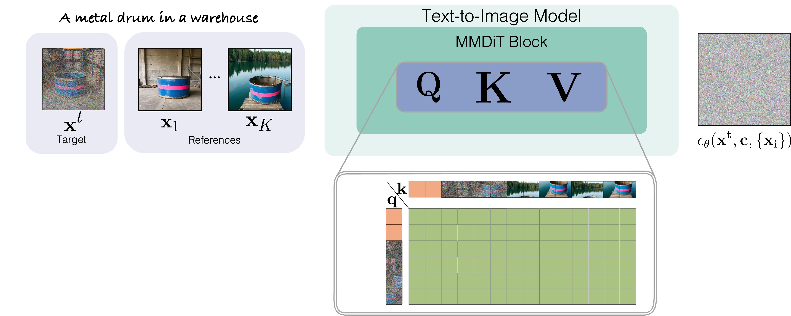

# Synthetic Customization Data (SynCD)

> *This is a reimplementation of the paper in diffusers framework after the end of internship. 


<br>
<div class="gif">
<p align="center">

</p>
</div>

We propose a pipeline for synthetic training data generation consisting of multiple images of the same object under different lighting, poses, and backgrounds, using either explicit 3D object assets or, more implicitly, using masked shared attention across different views. Given the training data, we train a new encoder-based model for customization/personalization. During inference, our method can successfully generate new compositions of a reference object using text prompts.

***Generating Multi-Image Synthetic Data for Text-to-Image Customization*** <br>
[Nupur Kumari](https://nupurkmr9.github.io/), [Xi Yin](https://xiyinmsu.github.io), [Jun-Yan Zhu](https://www.cs.cmu.edu/~junyanz/), [Ishan Misra](https://imisra.github.io), [Samaneh Azadi](https://github.com/azadis)<br>

### [website](https://www.cs.cmu.edu/~syncd-project/)  | [paper](https://arxiv.org/abs/2502.01720) 

## Sample Generated Dataset

https://github.com/user-attachments/assets/874eace8-a1dd-4c31-9226-f1cfb24f42bb

<strong>Note:</strong> We will release our final filtered dataset soon.

## Results

<div>
<p align="center">

</p>
<p align="center">

</p>
<p align="center">

</p>
<p align="center">

</p>
<p align="center">

</p>
</div>


## Qualitative Comparison

* With a single reference image as input:
<p align="center">

</p>

* With three reference images as input:
<p align="center">

</p>


## SynCD Overeview

<p align="center">

</p>

Our dataset generation pipeline is tailored for (a) Deformable categories where we use descriptive prompts and Masekd Shared Attention (MSA) among foreground objects regions of the images to promote visual consistency. (b) Rigid object categories, where we additionally employ depth and cross-view warping using exising Objaverse assets to ensure 3D multiview consistency. We further use DINOv2 and aesthetic score to filter out low-quality images to create our final training dataset.


## Model Overview


<p align="center">

</p>

We finetune a pre-trained IP-Adapter based model (global feature injection) on our genereated dataset (SynCD). During training we additinally employ Masked Shared Attentin (MSA) between target and reference features of the image (fine-grained feature injection). This helps the model to incorporate more fine-grained features from multiple reference images during inference.

## Getting Started

```
git clone https://github.com/nupurkmr9/syncd-project.git
conda create -n syncd python=3.10
conda activate syncd
pip3 install torch torchvision torchaudio (Or appropriate torch>2.0 from [https://pytorch.org/get-started/locally/](https://pytorch.org/get-started/locally/))
pip install -r assets/requirements.txt
```

**Dataset Generation**: Please refer [here](dataset/README.md) for dataset generation code. 

**Model Training**: Please refer [here](method/README.md) for dataset filtering and SDXL model training code. 

## Todo:

- [ ] Release the synthetic dataset (SynCD): by Feb 10
- [ ] Flux fine-tuning on the generated dataset. 


## Acknowledgements
We are grateful to the below works for their code/data/model. Our code is built upon them. 

* Diffusers: [https://huggingface.co/docs/diffusers/en/using-diffusers/sdxl](https://huggingface.co/docs/diffusers/en/using-diffusers/sdxl)
* Flux: [https://github.com/black-forest-labs/flux](https://github.com/black-forest-labs/flux)
* Cap3D: [https://huggingface.co/datasets/tiange/Cap3D](https://huggingface.co/datasets/tiange/Cap3D)
* SimpleTuner: [https://github.com/bghira/SimpleTuner](https://github.com/bghira/SimpleTuner)
* IP-Adapter: [https://ip-adapter.github.io](https://ip-adapter.github.io)
* Objaverse: [https://objaverse.allenai.org](https://objaverse.allenai.org)


## BibTeX

```
@article{kumari2025syncd,
  title={Generating Multi-Image Synthetic Data for Text-to-Image Customization},
  author={Kumari, Nupur and Yin, Xi and Zhu, Jun-Yan and Misra, Ishan and Azadi, Samaneh},
  journal={ArXiv},
  year={2025}
}
```
