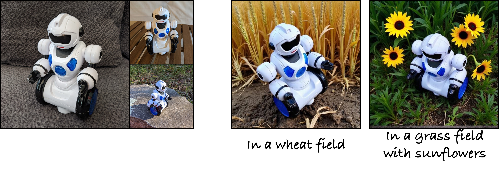
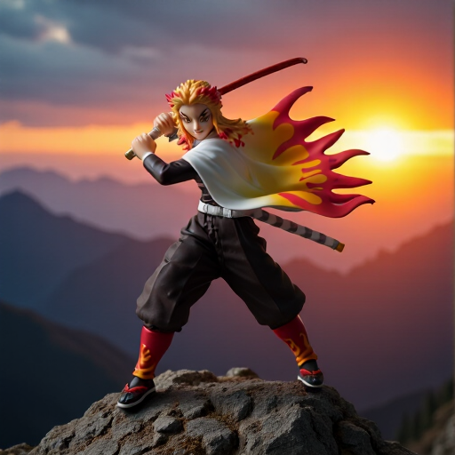

# Synthetic Customization Data (SynCD)

> *This is a reimplementation of the paper in diffusers framework after the end of the internship. 


<br>
<div class="gif">
<p align="center">

</p>
</div>

We propose a pipeline for synthetic training data generation consisting of multiple images of the same object under different lighting, poses, and backgrounds (as shown in (a)), using either explicit 3D object assets or, more implicitly, using masked shared attention across different views. Given the training data, we train a new encoder-based model for customization/personalization. During inference, our method can successfully generate new compositions of a reference object using text prompts with any number of reference images as input. Results with three and one reference image shown above in (b) and (c) respectively. 

***Generating Multi-Image Synthetic Data for Text-to-Image Customization*** <br> (ICCV 2025)    
[Nupur Kumari](https://nupurkmr9.github.io/), [Xi Yin](https://xiyinmsu.github.io), [Jun-Yan Zhu](https://www.cs.cmu.edu/~junyanz/), [Ishan Misra](https://imisra.github.io), [Samaneh Azadi](https://github.com/azadis)<br>

### [website](https://www.cs.cmu.edu/~syncd-project/)  | [paper](https://arxiv.org/abs/2502.01720)  | [Demo](https://huggingface.co/spaces/nupurkmr9/SynCD) 

## NEWS!!

* [Demo](https://huggingface.co/spaces/nupurkmr9/SynCD) based on [FLUX.1-dev](https://huggingface.co/black-forest-labs/FLUX.1-dev) model fine-tuning. 
* Training code with FLUX. See [here](method/README.md)

## Synthetic Customization Dataset (SynCD)

https://github.com/user-attachments/assets/874eace8-a1dd-4c31-9226-f1cfb24f42bb

<strong>Note:</strong> Our dataset is available to download [here](https://huggingface.co/datasets/nupurkmr9/syncd/tree/main)


## Results

<div>
<p align="center">

</p>
<p align="center">

</p>
<p align="center">

</p>
<p align="center">

</p>
<p align="center">

</p>
</div>


## Qualitative Comparison

* With a single reference image as input:
<p align="center">

</p>

* With three reference images as input:
<p align="center">

</p>


## SynCD Overview

<p align="center">

</p>

Our dataset generation pipeline is tailored for (a) Deformable categories where we use descriptive prompts and Masked Shared Attention (MSA) among foreground objects regions of the images to promote consistent object identity. (b) Rigid object categories, where we additionally employ depth conditioning and cross-view feature warping using existing Objaverse assets to ensure 3D multiview consistency. We further use DINOv2 and aesthetic score to filter out low-quality images to create our final training dataset. The Masked Shared Attention (MSA) and feature warping mechanism is shown in the below figure.

<p align="center">

</p>

**Warping and Masked Shared Attention**

For rigid objects, we first warp corresponding features from the first image to the other. Then, each image feature attends to itself, and the foreground object features in other images. We show an example mask, M1, used to ensure this for the first image when generating two images with the same object.

## Model Overview


<p align="center">

</p>

We finetune a pre-trained text-to-image model on our generated dataset (SynCD). During training, we employ Shared Attention, similar to the dataset generation pipeline, between target and reference features of the image. This helps the model incorporate fine-grained features from multiple reference images as attention is agnostic of sequence length.

## Getting Started

```
git clone https://github.com/nupurkmr9/syncd.git
cd syncd
conda create -n syncd python=3.10
conda activate syncd
pip3 install torch torchvision torchaudio  # (Or appropriate torch>2.0 from [https://pytorch.org/get-started/locally/](https://pytorch.org/get-started/locally/))
pip install -r assets/requirements.txt
```

**Sampling from our FLUX fine-tuned model**

Download the pretrained model and reference image:
```
cd method
mkdir -p pretrained_model
wget https://huggingface.co/spaces/nupurkmr9/SynCD/resolve/main/models/pytorch_model.bin?download=true -O pretrained_model/pytorch_model.bin
wget https://www.cs.cmu.edu/~syncd-project/assets/actionfigure_1.tar.gz
tar -xvzf actionfigure_1.tar.gz
```

```python

python sample_flux.py --prompt "An action figure on top of a mountain, sunset in the background. Realistic shot." --ref_images actionfigure_1 --finetuned_path pretrained_model/pytorch_model.bin --numref 3 --true_cfg_scale 1.5

# For faster sampling, you can disable seprate image and text guidance by setting true_cfg_scale to 1.0. 
```
This should generate an image like below:

<p align="center">

</p>

**Generating your own Dataset**: Please refer [here](dataset/README.md) for dataset generation and filtering. 

**Model Training with Generated Dataset**: Please refer [here](method/README.md) for SDXL and FLUX model fine-tuning code. 

## Todo:

- [x] Release the synthetic dataset (SynCD): Avaialble to download [here](https://huggingface.co/datasets/nupurkmr9/syncd/tree/main).
- [x] Flux fine-tuning on our dataset.

## Acknowledgements
We are grateful to the below works for their code/data/model. Our code is built upon them. 

* Diffusers: [https://huggingface.co/docs/diffusers/en/using-diffusers/sdxl](https://huggingface.co/docs/diffusers/en/using-diffusers/sdxl)
* Flux: [https://github.com/black-forest-labs/flux](https://github.com/black-forest-labs/flux)
* Cap3D: [https://huggingface.co/datasets/tiange/Cap3D](https://huggingface.co/datasets/tiange/Cap3D)
* SimpleTuner: [https://github.com/bghira/SimpleTuner](https://github.com/bghira/SimpleTuner)
* IP-Adapter: [https://ip-adapter.github.io](https://ip-adapter.github.io)
* Objaverse: [https://objaverse.allenai.org](https://objaverse.allenai.org)


## BibTeX

```
@inproceedings{kumari2025syncd,
  title={Generating Multi-Image Synthetic Data for Text-to-Image Customization},
  author={Kumari, Nupur and Yin, Xi and Zhu, Jun-Yan and Misra, Ishan and Azadi, Samaneh},
  booktitle={IEEE International Conference on Computer Vision (ICCV)},
  year={2025}
}
```
