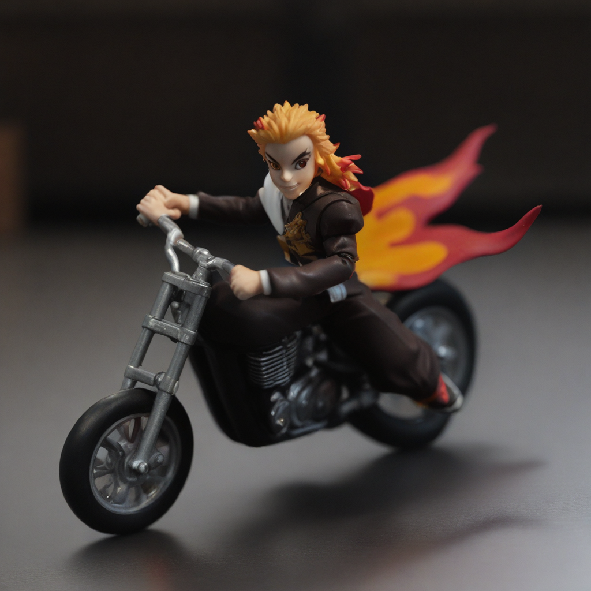

## Getting Started

The base environment setup. Same as [here](https://github.com/nupurkmr9/syncd/blob/main/README.md#getting-started)

```
git clone https://github.com/nupurkmr9/syncd.git
cd syncd
conda create -n syncd python=3.10
conda activate syncd
pip3 install torch torchvision torchaudio  # (Or appropriate torch>2.0 from [https://pytorch.org/get-started/locally/](https://pytorch.org/get-started/locally/))
pip install -r assets/requirements.txt
cd method
```

### Sampling

Download the pretrained model and reference image if not done already:
```
mkdir -p pretrained_model
wget https://huggingface.co/spaces/nupurkmr9/SynCD/resolve/main/models/pytorch_model.bin?download=true -O pretrained_model/pytorch_model.bin
wget https://www.cs.cmu.edu/~syncd-project/assets/sdxl_finetuned_20k.ckpt -P pretrained_model
wget https://www.cs.cmu.edu/~syncd-project/assets/actionfigure_1.tar.gz
tar -xvzf actionfigure_1.tar.gz
```


```python
# sample from SDXL model
python sample.py --prompt "An action figure riding a motorcycle" --ref_images actionfigure_1 --ref_category "action figure" --finetuned_path pretrained_model/sdxl_finetuned_20k.ckpt
```

This should generate an image like below:

<p align="center">

</p>

```python
# sample from FLUX model
python sample_flux.py --prompt "An action figure on top of a mountain, sunset in the background. Realistic shot." --ref_images actionfigure_1 --finetuned_path pretrained_model/pytorch_model.bin --numref 3 --true_cfg_scale 1.5

# For faster sampling, you can disable seprate image and text guidance by setting true_cfg_scale to 1.0. 
```

This should generate an image like below:

<p align="center">

</p>

### Training on our Dataset

Training requires 80GB VRAM GPUs

* Download our dataset:

```
cd method
git lfs install
git clone https://huggingface.co/datasets/nupurkmr9/syncd
cd syncd
bash unzip.sh 
cd ..
```

* Fine-tune FLUX.
```
deepspeed main_flux.py --base configs/train_flux.yaml --name flux_syncd 
```


* Fine-tune SDXL
```
python main.py --base configs/train_sdxl.yaml --name sdxl_syncd 
```

You can train on your own dataset by updating the hyperparameters, including dataset path and filtering thresholds, at `data.params` in the config.